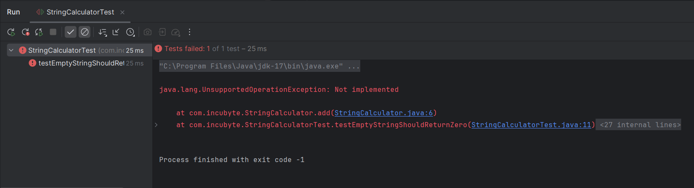
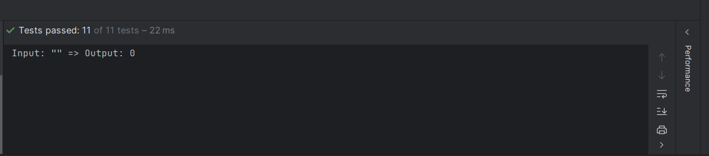

# String Calculator - TDD Kata 🚀

## 📌 Problem Statement
Build a `StringCalculator` with a method `int add(String numbers)` that:
- Accepts a string containing numbers separated by delimiters.
- Returns the **sum** of the numbers.
- Supports comma `,`, new lines `\n`, and custom/multiple delimiters.
- Ignores numbers > 1000 and throws exception for negatives.

---

## 🧠 Approach Used
We used **Test-Driven Development (TDD)** to solve the problem. 

### 🤔 Why TDD?
TDD ensures clean, testable code and gives you confidence during refactoring. It makes debugging easier and encourages smaller, focused methods.

---
## 🔄 TDD Lifecycle Explained
TDD follows a **three-phase cycle**:

| Phase      | Description                                              |
|------------|----------------------------------------------------------|
| 🔴 RED     | Write a test that fails for the expected feature         |
| 🟢 GREEN   | Write the minimum code to pass that test                |
| 🛠 REFACTOR| Clean up the code while keeping the tests passing       |

## 🧱 Project Structure (Maven)
```
StringCalculatorTDD/
├── src/
│   ├── main/java/com/incubyte/StringCalculator.java
│   └── test/java/com/incubyte/StringCalculatorTest.java
├── pom.xml
├── README.md
└── screenshots/ (optional)
```
## 🔧 Technologies Used
- **Java (JDK 17)** – Core logic
- **JUnit 4.13.2** – Unit testing framework
- **IntelliJ IDEA** – IDE used to build and test
- **Git + GitHub** – Version control

---

## ✅ Why Java + JUnit?
- Java is widely adopted and easy to write readable code in.
- JUnit is a robust, lightweight testing framework for **unit testing** in Java. It integrates perfectly with Maven/IntelliJ.

### 🔍 How JUnit Works
JUnit lets us:
- Annotate test methods using `@Test`
- Use assertions like `assertEquals`, `assertThrows`
- Automatically run test suites

### 🧪 Running Unit Tests in IntelliJ
- Right-click on the test method/class > Run
- View results in the bottom test runner panel

---

## 🧪 Example: Empty String TDD Cycle
We walk through **one complete TDD cycle** using the empty string case.

### 🔴 RED Phase — Failing Test
We began by writing a test for the simplest scenario: when the input string is empty (`""`), the method should return `0`. Since the method was not implemented at that point, this test **failed** as expected — marking the beginning of the **RED phase**.

📸 

### 🟢 GREEN Phase — Make Test Pass
In the GREEN phase, we wrote the minimal logic required to pass the test — adding a condition to return 0 if the string is null or empty. This allowed the test to pass ✅.

📸 

### 🛠 REFACTOR Phase — Code Cleanup
After the test passed, we moved to the **REFACTOR** phase. Although the logic was correct, we restructured the code to make it more maintainable and scalable.

📝 **Other screenshots** are available in the `screenshots/` folder.

## ✅ All Test Cases Summary
Each case followed Red → Green (+Refactor where needed):
1. Empty string returns 0
2. Single number returns number
3. Two numbers comma-separated
4. Any count of numbers
5. Newlines support
6. Custom delimiters `//;\n1;2`
7. Negative numbers throw exception
8. Numbers >1000 are ignored
9. Multi-char delimiter: `//[***]\n1***2***3`
10. Multiple delimiters: `//[*][%]\n1*2%3`
11. Multiple long delimiters: `//[***][%%]\n1***2%%3***4`

---

## ✨ Final Thoughts
**💡 This project demonstrates not only my technical ability to implement TDD with Java and JUnit, but also my mindset as a passionate software developer who believes in writing clean, testable, and maintainable code. I had just 2 days — yet I was able to quickly learn, apply, and document the TDD process end-to-end. That reflects my attitude, learning speed, and strong interest in real-world software craftsmanship.** 💪

Thanks for reviewing! 🚀

